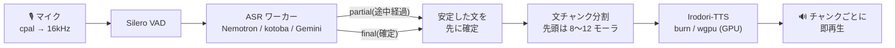

<div align="center">


# sttts-gui

[English](README.md) · **日本語** · [简体中文](README.zh-CN.md)

**話した声を、そのまま別の声で。**

マイクの声をリアルタイムに文字起こしし、[Irodori-TTS](https://github.com/Aratako/Irodori-TTS) で
好きな声に変えて読み上げる、Windows 向けの音声対話アプリ。<br>
UI からマイク・VAD・ASR・TTS まで、**Rust 1 プロセスだけ**で動きます。Python も PyTorch も要りません。


[](LICENSE)

</div>

---

## 特長

- 🎙️ **話し終わる前に読み上げ始める** — 確定した文から順に合成・再生します。話し続けていても、文が切れたところから読み上げが追いかけます
- 🦀 **ピュア Rust 推論** — Irodori-TTS と kotoba-whisper を [burn](https://burn.dev) で再実装し、PyTorch と数値一致を確認済み。Intel Arc B570 で RTF ≈ 0.3
- 🎭 **声のバンク** — 10 秒ほどの参照音声をドラッグ&ドロップすると、その声で話します。テンポや間など、元の話し方の表現も Irodori に渡します
- 🔀 **ASR を選べる** — Nemotron 3.5(句読点付き・ローカル)/ kotoba-whisper(ローカル GPU)/ Gemini Live(クラウド)
- 🎚️ **ASIO 対応** — ⚙ 詳細設定でドライバ(WASAPI / 各 ASIO ドライバ)を選び、WASAPI ならデバイス、ASIO なら使うチャンネル(入力は 1ch ずつか 2ch の組、出力は 2ch の組か 1ch)を選べます
- 📦 **モデルは自動で取得** — 初回起動時に HuggingFace から必要なものだけを取得します。手動の準備はいりません
- 🌐 **英語 / 日本語 / 簡体字中国語の UI** — Windows の表示言語に合わせて起動し、⚙ 詳細設定でいつでも切り替えられます(認識と音声合成は日本語向けです)
- ⏱️ **遅延を常に表示** — 話し終わりから最初の音が鳴るまで(発話終了→初音)を、毎回タイトルバーに表示します

## クイックスタート

**必要なもの**: Windows 11 / Vulkan 対応 GPU(Intel Arc・NVIDIA・AMD。Intel Arc B570 で検証)/ Rust 1.95 以上 + MSVC ビルドツール + [LLVM](https://github.com/llvm/llvm-project/releases)(ASIO バインディング生成の libclang 用。ASIO SDK はビルド時に自動取得)

```powershell
git clone https://github.com/kjranyone/sttts-gui.git
cd sttts-gui
.\dev.ps1            # ビルドして起動(初回はモデルを自動ダウンロード)
```

| コマンド | 用途 |
|---|---|
| `.\dev.ps1 -Mode real` | 実エンジンで起動(対話なし) |
| `.\dev.ps1 -Mode mock` | モデルを使わずに UI と配線だけ確認 |
| `.\dev.ps1 -DebugBuild` | debug プロファイルで起動 |
| `cargo run --release -p sttts-gui -- --real` | スクリプトを使わずに直接起動 |

モデルは Irodori-TTS ≈3GB + コーデック ≈0.4GB + 選んだ ASR の分です。HuggingFace のキャッシュ(`~/.cache/huggingface/hub`)を共有します。

### exe を配布する場合

`cargo build --release` でできる `target/release/sttts-gui.exe` は単体で動きます(アイコン・VAD モデル・onnxruntime を内蔵)。設定や声のバンク(`data/`)、生成した WAV(`output/`)は次の場所に保存します。

1. 環境変数 `STTTS_ROOT` があればそこ
2. exe の隣に書き込めれば exe のフォルダ(USB メモリ等に置くポータブル運用)
3. 書き込めない場所(Program Files 等)なら `%LOCALAPPDATA%\sttts-gui`

macOS / Linux 版(`sttts-say` のみ・実験的)は実行ファイルの隣には書き込みません。`STTTS_ROOT` が無ければ、macOS は `~/Library/Application Support/sttts-gui`、Linux は `$XDG_DATA_HOME/sttts-gui`(無ければ `~/.local/share/sttts-gui`)に保存します。

配布先には [Visual C++ 再頒布可能パッケージ](https://learn.microsoft.com/cpp/windows/latest-supported-vc-redist)(x64)と、DirectX 12 / Vulkan に対応した GPU ドライバが必要です。

> [!IMPORTANT]
> **ヘッドホンを使ってください。** マイクは再生中も開いたままです(エコーキャンセルは未実装)。スピーカーだと合成音声をマイクが拾い、それが文字起こしされて自動発話されるループが起きます。

## 仕組み



Irodori-TTS は文単位の非ストリーミング合成です。そこで **文をチャンクに切る → チャンクごとに合成 → できたものから再生** という疑似ストリーミングにしています。初音までの時間は先頭チャンクの長さに比例するので、先頭だけを短く切ります。

全体は 1 プロセスで動きます。GUI([GPUI](https://github.com/zed-industries/zed/tree/main/crates/gpui) / gpui-kit)とエンジンはチャネルでつながり、VAD・ASR・TTS はそれぞれ専用スレッドで回ります。重いデコード中もレベルメーターは止まりません。詳しくは [上級設定とチューニング](docs/configuration.md) を参照してください。

## 使い方

画面は「何を話したか / どう伝えるか / どの声で届けるか」を分けて見せます。

| 場所 | できること |
|---|---|
| **ストリーム**(中央) | 1 枚のカード = 話した内容(上段)と、それを届けた声(下段)。届けた後は ▶ もう一度聞く / ↻ 今の声で話し直す / 訂正 |
| **入力欄**(下) | 文字を入力して **話す**(Ctrl+Enter)。**止める** で再生中・未再生の音声を破棄 |
| **ライブ** | マイクの開始/停止と入力レベル |
| **音声キュー** | 「自動再生」ON で認識した文をそのまま読み上げ。OFF ならカードで止めて、話す・訂正・話さないを選ぶ。「テンポと間を再現」で元音声の速さを反映 |
| **声** | 声バンクの選択と、話し方の指示(Irodori の caption) |
| **認識** | クラウド(Gemini)とローカルの切替、Gemini の API キー入力 |
| **⚙ 詳細設定** | 表示言語、入出力デバイス、音声合成モデルなど、環境ごとに一度決めればよい設定 |

演技パレットや絵文字による表現指示は [Irodori への表現指示](docs/irodori-annotations.md)、話し方を再現する仕組みは [発話の表現を再構築する設計](docs/acting-reconstruction-design.md) にまとめています。

### 声のバンク

参照音声(wav / flac、10 秒程度)をウィンドウへドラッグ&ドロップするか、「声」の「＋」から選びます。取り込んだ音声は `data/voices/` に入り、そのまま選択されます。画像(png / jpg / webp)を落とすと、選択中の声のアイコンになります。

声のプリセットを 8 つ同梱しています(`genki` `kuudere` `narrator` `ojisan` `oneesan` `seinen` `shounen` `tsundere`)。初回起動時に `data/voices/` へ書き出され、自分で取り込んだ声と同じように使ったり消したりできます。消したプリセットは復活せず、同じ名前の自分の声は上書きしません。プリセットは Gemini TTS で作った合成音声で、実在の人物の録音ではありません。

> [!CAUTION]
> 参照音声には、本人の同意を得た声だけを使ってください。Irodori-TTS の各モデルカードは、実在人物のなりすましやディープフェイクへの利用を禁じています。

### コマンドラインから合成する(sttts-say)

`sttts-say.exe`(`cargo build --release` で GUI と一緒にできます)は、GUI を開かずにセリフを WAV にします。エージェント(Agent Skills)や動画制作のワークフローから、キャラクターの声で「このセリフをこう喋らせる」部品として使えます。

```powershell
sttts-say speak --text "ねえ、聞いて!" --voice mio --style "興奮気味に" --out s01.wav
sttts-say render ep1.jsonl          # 台本(JSONL)をまとめて。変えた行だけ撮り直す
sttts-say audition --text "はじめまして" --caption "明るい少女の声" --count 6
sttts-say voice save mio --from <選んだテイク>.wav   # テイクを参照音声にしてキャラクターを固定
sttts-say model use v4.1-small      # 高品質な RF のモデルに切り替える(遅い。一度選べば記録される)
```

選べるモデルは `sttts-say model list` で見られます。

| モデル | ダウンロード | 向き |
|---|---|---|
| `v4.1-small-mf`(既定) | 3.1 GB | MeanFlow、4 ステップ。会話に使える速さ |
| `v4.1-small` | 3.1 GB | RF、40 ステップ + CFG。漢字の読みと声の再現がより正確。計算量は約 20 倍 |
| `v4.1-small-int8` | 0.9 GB | `v4.1-small` の重みを int8 にしたもの。主な層の GPU メモリが約 1/4。GPU メモリが少ない環境向け |
| `v4-large` | 13 GB | 33 億パラメータ。キャプションと長い参照音声への追従が最も良い。GPU メモリは 16GB 程度必要 |
| `v4-large-int8` | 3.8 GB | `v4-large` の重みを int8 にしたもの。中程度の GPU 向け |

CLI はリアルタイムでなくてよいので、遅くても正確なモデルが向いています。選んだモデルは `data/backend.json` の `tts.model` に記録されます(GUI は詳細設定での自分の選択を使います)。v4 Large はテキストエンコーダが T5Gemma 2 由来のため、[Gemma の利用規約](https://ai.google.dev/gemma/terms)に従います。

ビルド済みのものは [Releases](https://github.com/kjranyone/sttts-gui/releases) にあります(CLI だけの zip もあります)。macOS(Apple Silicon)と Linux x64 向けの `sttts-say` も置いていますが、CI でのビルドとテストのみで、実機では未検証の実験版です。macOS は Metal、Linux は Vulkan ドライバと OpenSSL 3 が必要です。macOS で未署名のためブロックされたら `xattr -d com.apple.quarantine sttts-say` を実行してください。ソースからは `cargo build --release -p sttts-say` でビルドできます。GPU を使うのは同時に 1 プロセスだけです(GUI を開いている間はエラーで止まります)。仕組みは [sttts-say](docs/sttts-say.md)、Skill は [`skills/sttts-say/SKILL.md`](skills/sttts-say/SKILL.md) にあります。

## モデル

| 役割 | モデル | 実行環境 | 備考 |
|---|---|---|---|
| TTS | [Irodori-TTS v4.1 Small MeanFlow](https://huggingface.co/Aratako/Irodori-TTS-v4.1-Small-MF) | GPU(burn / wgpu) | 既定。RTF ≈ 0.3(Arc B570)。CPU 推論はしません |
| TTS | [Irodori-TTS v4.1 Small](https://huggingface.co/Aratako/Irodori-TTS-v4.1-Small)(RF)と [int8 版](https://huggingface.co/Aratako/Irodori-TTS-v4.1-Small-Quantized) | GPU(burn / wgpu) | 40 ステップ + CFG。より正確だが計算量は約 20 倍。`sttts-say` などリアルタイムでない用途向け |
| TTS | [Irodori-TTS v4 Large](https://huggingface.co/Aratako/Irodori-TTS-v4-Large)(RF)と [int8 版](https://huggingface.co/Aratako/Irodori-TTS-v4-Large-Quantized) | GPU(burn / wgpu) | 33 億パラメータ、T5Gemma 2 のテキストエンコーダ([Gemma の利用規約](https://ai.google.dev/gemma/terms)) |
| ASR | Nemotron 3.5 ASR streaming 0.6B | CPU(onnxruntime) | **句読点を出力**、whisper large-v3 級の精度。途中経過は前回の続きから計算するので軽い。母音だけの連続(「あいうえお」等)は苦手 |
| ASR | [kotoba-whisper-v2.0](https://huggingface.co/kotoba-tech/kotoba-whisper-v2.0) | GPU(burn / wgpu) | 既定。句読点は出ない。10 秒の発話で約 4 秒 |
| ASR | Gemini 3.5 Transcribe Live | クラウド | 最速。要 API キー(GUI から入力し、DPAPI で暗号化して保存) |
| VAD | [Silero VAD](https://github.com/snakers4/silero-vad) | CPU(ONNX) | バイナリに埋め込み |

## プロジェクト構成

```
crates/
├── gui/        GPUI クライアント。エンジンをプロセス内で起動する
├── say/        CLI(sttts-say):GUI なしでセリフを合成する
├── engine/     バックエンド本体:設定・チャンク分割・TTS ワーカー・ライブセッション
├── protocol/   GUI ⇄ エンジンのメッセージ型
├── i18n/       表示言語(en / ja / zh)と文言のインライン翻訳
├── irodori/    Irodori-TTS の純 Rust 推論(設計と精度 → docs/irodori-rs.md)
├── whisper/    kotoba-whisper の純 Rust 推論
├── nemotron/   Nemotron 3.5 ASR(ONNX)
├── gemini/     Gemini Live API クライアント
├── audio/      マイク・リサンプル・Silero VAD
└── hub/        HuggingFace Hub のキャッシュ探索と自動ダウンロード
```

## 開発

```powershell
cargo test -p sttts-engine          # 実モデル・実デバイス無しでパイプライン全体を検証
cargo test --workspace --release    # 全クレート(参照データが無いパリティテストは skip)
```

エンジンは外界(デバイス・モデル)を `Platform` トレイトで注入する設計です。テストでは偽のマイク・VAD・ASR・TTS を差し込み、mic-first、停止→再開のクールダウン、キャンセル、逐次読み上げまでを検証します。PyTorch との数値一致テストに使う参照データは `tools/reference/` のスクリプトで作れます(アプリの実行には不要)。

UI の文言は 3 言語を呼び出し箇所に並べて書きます(`tr!("English", "日本語", "中文")`)。訳漏れはコンパイルエラーになります。

コントリビュートする前に [AGENTS.md](AGENTS.md) を読んでください(ハードウェア検証のポリシーと設計の前提)。

リリースの手順は [docs/releasing.md](docs/releasing.md) にあります。

## トラブルシューティング

| 症状 | 対処 |
|---|---|
| GPU を初期化できない | Vulkan 対応 GPU とドライバを確認(Intel Arc は最新ドライバへ)。CPU への自動フォールバックはありません |
| 「音声合成デバイスが停止しました」 | GPU のデバイス喪失です。アプリを再起動してください |
| 文中の短い間で発話が切れる | `asr.vad_min_silence_ms` を 350〜400 に上げる |
| 合成音声を拾ってループする | ヘッドホンを使う |
| 最初の発話まで時間がかかる | 初回はモデルのダウンロードと GPU カーネルの準備があります。2 回目からは起動直後にバックグラウンドでロードが始まります |
| マイクを開けない | 他のアプリによる排他占有を解除する。入力デバイスは ⚙ 詳細設定で選べます |
| ASIO デバイスを開けない | ASIO は同時に 1 ドライバのみ。入力と出力で別の ASIO ドライバは選べません(同じドライバ同士、または片方を WASAPI に)。DAW など他のアプリが掴んでいないかも確認。レート・バッファはドライバのコントロールパネルの設定に従います |
| ビルドで `asiodrivers.h` が無い | `%TEMP%\asio_sdk` が中身の消えた状態で残っています。フォルダを消して再ビルドすると SDK を取り直します |
| 認識が遅い | Gemini を選ぶか、ローカルなら `asr.engine: "nemotron"` |

ログは GUI 下段と `data/gui.log`(起動ごとに作り直し)に出ます。設定キーの一覧は [docs/configuration.md](docs/configuration.md) にあります。

## Code signing policy(コード署名ポリシー)

[GitHub Releases](https://github.com/kjranyone/sttts-gui/releases) の Windows 版は、このリポジトリから GitHub Actions([リリース用ワークフロー](.github/workflows/release.yml))でビルドし、リリースごとに手動で承認してから署名します。

Free code signing provided by [SignPath.io](https://about.signpath.io/), certificate by [SignPath Foundation](https://signpath.org/).

> 状況: SignPath Foundation へ申請中です。承認されるまでのリリースは署名なしです。ダウンロードしたファイルは `SHA256SUMS.txt` で確かめてください。

チームの役割:

- Authors(レビューなしでソースを変更できる): [@kjranyone](https://github.com/kjranyone)
- Reviewers(他の貢献者の変更をレビューする): [@kjranyone](https://github.com/kjranyone)
- Approvers(署名の要求を 1 件ずつ承認する): [@kjranyone](https://github.com/kjranyone)

プライバシー: [プライバシーポリシー](PRIVACY.md)(英語)を参照してください。要点は、Hugging Face からのモデルのダウンロード(`HF_HUB_OFFLINE=1` で無効化できます)と、クラウド認識を選んだときだけ発話を Google Gemini へ送ること以外、何も送信しないことです。

## クレジット

- [Irodori-TTS](https://github.com/Aratako/Irodori-TTS)(MIT)と [v4.1-Small-MF](https://huggingface.co/Aratako/Irodori-TTS-v4.1-Small-MF)・[Semantic-DACVAE-Japanese-32dim](https://huggingface.co/Aratako/Semantic-DACVAE-Japanese-32dim)(MIT)、透かしの [SilentCipher](https://huggingface.co/sony/silentcipher)。各モデルカードには、ライセンスとは別に倫理的な利用制限があります
- [kotoba-whisper-v2.0](https://huggingface.co/kotoba-tech/kotoba-whisper-v2.0)(Apache-2.0)
- Nemotron 3.5 ASR streaming(コード Apache-2.0 / 重み OpenMDW-1.1)
- [silero-vad](https://github.com/snakers4/silero-vad)(MIT、`crates/audio/assets/LICENSE`)
- 声のプリセット(`crates/engine/assets/voices/`、リポジトリと同じ MIT): Google Gemini TTS で生成(`tools/voice-presets/`)
- [burn](https://burn.dev)(Apache-2.0 / MIT)、onnxruntime(MIT)、gpui-kit / Zed GPUI(Apache-2.0)

## ライセンス

[MIT](LICENSE)。ただし `crates/nemotron/` は参照実装に由来するため Apache-2.0(`crates/nemotron/LICENSE`)です。

モデルの重みはこのリポジトリに含まれず、それぞれのライセンスと利用制限に従います(上記クレジットを参照)。
