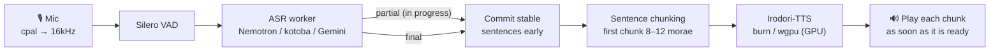

<div align="center">


# sttts-gui

**English** · [日本語](README.ja.md) · [简体中文](README.zh-CN.md)

**Speak, and be heard in another voice.**

A voice app for Windows that transcribes your microphone in real time and reads it aloud in the voice of your choice
with [Irodori-TTS](https://github.com/Aratako/Irodori-TTS).<br>
Everything from the UI to the mic, VAD, ASR and TTS runs in **a single Rust process**. No Python, no PyTorch.


[](LICENSE)

</div>

---

> [!NOTE]
> Speech recognition and synthesis are built for **Japanese**. Irodori-TTS is a Japanese TTS model, and the local ASR models are Japanese models. The UI language setting changes only the interface.

## Features

- 🎙️ **Starts reading before you finish talking** — confirmed sentences are synthesized and played in order. While you keep talking, playback follows from where each sentence ends
- 🦀 **Pure Rust inference** — Irodori-TTS and kotoba-whisper are reimplemented on [burn](https://burn.dev) and verified to match PyTorch numerically. RTF ≈ 0.3 on an Intel Arc B570
- 🎭 **Voice bank** — drag and drop about 10 seconds of reference audio and it speaks in that voice. Expression such as tempo and pauses in the original speech is also passed to Irodori
- 🔀 **Choice of ASR** — Nemotron 3.5 (with punctuation, local) / kotoba-whisper (local GPU) / Gemini Live (cloud)
- 🎚️ **ASIO support** — in ⚙ Settings, choose the driver (WASAPI / each ASIO driver), then the device for WASAPI or the channels for ASIO (input: single channels or a 2-channel pair; output: a 2-channel pair or a single channel)
- 📦 **Models are fetched automatically** — on first launch only what is needed is downloaded from HuggingFace. No manual setup
- 🌐 **UI in English / Japanese / Simplified Chinese** — starts in the Windows display language and can be switched at any time in ⚙ Settings
- ⏱️ **Latency always on screen** — the time from the end of your speech to the first sound (end of speech → first audio) is shown in the title bar every time

## Quick start

**Requirements**: Windows 11 / a Vulkan-capable GPU (Intel Arc, NVIDIA, AMD; tested on Intel Arc B570) / Rust 1.95 or later + MSVC build tools + [LLVM](https://github.com/llvm/llvm-project/releases) (libclang for generating the ASIO bindings; the ASIO SDK is fetched automatically at build time)

```powershell
git clone https://github.com/kjranyone/sttts-gui.git
cd sttts-gui
.\dev.ps1            # build and launch (models are downloaded on first run)
```

| Command | Purpose |
|---|---|
| `.\dev.ps1 -Mode real` | Launch with the real engine (no prompt) |
| `.\dev.ps1 -Mode mock` | Check only the UI and wiring, without models |
| `.\dev.ps1 -DebugBuild` | Launch with the debug profile |
| `cargo run --release -p sttts-gui -- --real` | Launch directly without the script |

Models take Irodori-TTS ≈3GB + codec ≈0.4GB + the ASR you choose. The HuggingFace cache (`~/.cache/huggingface/hub`) is shared.

### Distributing the exe

`target/release/sttts-gui.exe`, built with `cargo build --release`, runs on its own (icon, VAD model and onnxruntime are embedded). Settings and the voice bank (`data/`) and generated WAVs (`output/`) are stored in:

1. `STTTS_ROOT`, if the environment variable is set
2. The exe's folder, if it is writable next to the exe (portable use, e.g. on a USB drive)
3. `%LOCALAPPDATA%\sttts-gui`, if it is not writable (Program Files, etc.)

The target machine needs the [Visual C++ Redistributable](https://learn.microsoft.com/cpp/windows/latest-supported-vc-redist) (x64) and a GPU driver with DirectX 12 / Vulkan support.

> [!IMPORTANT]
> **Use headphones.** The mic stays open during playback (there is no echo cancellation). With speakers, the mic picks up the synthesized voice, which is transcribed and spoken again automatically, in a loop.

## How it works



Irodori-TTS synthesizes whole sentences, without streaming. So the app does pseudo-streaming: **split sentences into chunks → synthesize each chunk → play whatever is ready**. Time to first audio is proportional to the length of the first chunk, so only the first chunk is cut short.

Everything runs in one process. The GUI ([GPUI](https://github.com/zed-industries/zed/tree/main/crates/gpui) / gpui-kit) and the engine are connected by channels, and VAD, ASR and TTS each run on their own thread. The level meter keeps moving even during heavy decoding. See [Advanced settings and tuning](docs/configuration.md) (Japanese) for details.

## Usage

The screen separates *what you said*, *how it is delivered* and *which voice delivers it*.

| Area | What you can do |
|---|---|
| **Stream** (center) | One card = what you said (top) and the voice that delivered it (bottom). After delivery: ▶ play again / ↻ speak again with the current voice / correct |
| **Input box** (bottom) | Type text and **Speak** (Ctrl+Enter). **Stop** discards audio that is playing or not yet played |
| **Live** | Start/stop the mic, and the input level |
| **Audio queue** | With "Auto play" ON, recognized sentences are read aloud as they are. With it OFF, each stops at its card so you can speak, correct or skip it. "Match tempo and pauses" reflects the speed of the original speech |
| **Voice** | Pick a voice from the bank and give a speaking-style instruction (Irodori's caption) |
| **Recognition** | Switch between cloud (Gemini) and local, and enter the Gemini API key |
| **⚙ Settings** | Settings you decide once per machine: display language, input/output devices, TTS model |

The acting palette and emoji-based expression are described in [Expression instructions for Irodori](docs/irodori-annotations.md), and the mechanism for reproducing the way you speak in [Design for reconstructing delivery](docs/acting-reconstruction-design.md) (both in Japanese).

### Voice bank

Drag and drop reference audio (wav / flac, about 10 seconds) onto the window, or pick it with "+" under "Voice". Imported audio goes into `data/voices/` and is selected right away. Drop an image (png / jpg / webp) to make it the icon of the selected voice.

> [!CAUTION]
> Only use reference audio from people who have given their consent. The Irodori-TTS model cards prohibit impersonating real people and creating deepfakes.

## Models

| Role | Model | Runs on | Notes |
|---|---|---|---|
| TTS | [Irodori-TTS v4.1 Small MeanFlow](https://huggingface.co/Aratako/Irodori-TTS-v4.1-Small-MF) | GPU (burn / wgpu) | RTF ≈ 0.3 (Arc B570). No CPU inference |
| ASR | Nemotron 3.5 ASR streaming 0.6B | CPU (onnxruntime) | **Outputs punctuation**, whisper large-v3 class accuracy. Partial results continue from the previous computation, so they are cheap. Weak on runs of vowels only (e.g. 「あいうえお」) |
| ASR | [kotoba-whisper-v2.0](https://huggingface.co/kotoba-tech/kotoba-whisper-v2.0) | GPU (burn / wgpu) | Default. No punctuation. About 4 s for a 10-second utterance |
| ASR | Gemini 3.5 Transcribe Live | Cloud | Fastest. Requires an API key (entered in the GUI and stored encrypted with DPAPI) |
| VAD | [Silero VAD](https://github.com/snakers4/silero-vad) | CPU (ONNX) | Embedded in the binary |

## Project layout

```
crates/
├── gui/        GPUI client. Starts the engine in-process
├── engine/     Backend: config, chunking, TTS worker, live session
├── protocol/   GUI ⇄ engine message types
├── i18n/       UI language (en / ja / zh) and inline translations
├── irodori/    Pure Rust inference for Irodori-TTS (design and accuracy → docs/irodori-rs.md)
├── whisper/    Pure Rust inference for kotoba-whisper
├── nemotron/   Nemotron 3.5 ASR (ONNX)
├── gemini/     Gemini Live API client
├── audio/      Mic, resampling, Silero VAD
└── hub/        HuggingFace Hub cache lookup and automatic downloads
```

## Development

```powershell
cargo test -p sttts-engine          # verify the whole pipeline without real models or devices
cargo test --workspace --release    # all crates (parity tests without reference data are skipped)
```

The engine takes the outside world (devices, models) through the `Platform` trait. Tests plug in a fake mic, VAD, ASR and TTS and verify mic-first startup, the stop → restart cooldown, cancellation and incremental reading. The reference data for the PyTorch parity tests can be generated with the scripts in `tools/reference/` (not needed to run the app).

UI text is written inline with all three languages side by side (`tr!("English", "日本語", "中文")`), so a missing translation is a compile error.

Read [AGENTS.md](AGENTS.md) (Japanese) before contributing: it covers the hardware testing policy and the design principles.

## Troubleshooting

| Symptom | Fix |
|---|---|
| The GPU cannot be initialized | Check for a Vulkan-capable GPU and driver (update Intel Arc to the latest driver). There is no automatic fallback to CPU |
| "The speech synthesis device stopped" | The GPU device was lost. Restart the app |
| Speech is cut at short pauses mid-sentence | Raise `asr.vad_min_silence_ms` to 350–400 |
| The synthesized voice is picked up and loops | Use headphones |
| The first utterance takes a long time | The first run downloads models and prepares GPU kernels. From the second run on, loading starts in the background right after launch |
| The mic cannot be opened | Release exclusive use by other apps. The input device can be chosen in ⚙ Settings |
| An ASIO device cannot be opened | Only one ASIO driver can be open at a time, so input and output cannot use different ASIO drivers (use the same driver for both, or WASAPI for one side). Also check that no other app such as a DAW holds it. Sample rate and buffer follow the driver's control panel |
| The build cannot find `asiodrivers.h` | `%TEMP%\asio_sdk` was left behind with its contents gone. Delete the folder and rebuild to fetch the SDK again |
| Recognition is slow | Choose Gemini, or locally use `asr.engine: "nemotron"` |

Logs appear in the bottom panel of the GUI and in `data/gui.log` (recreated on every launch). The list of settings keys is in [docs/configuration.md](docs/configuration.md) (Japanese).

## Credits

- [Irodori-TTS](https://github.com/Aratako/Irodori-TTS) (MIT) with [v4.1-Small-MF](https://huggingface.co/Aratako/Irodori-TTS-v4.1-Small-MF) and [Semantic-DACVAE-Japanese-32dim](https://huggingface.co/Aratako/Semantic-DACVAE-Japanese-32dim) (MIT), and [SilentCipher](https://huggingface.co/sony/silentcipher) for watermarking. Each model card has ethical usage restrictions in addition to its license
- [kotoba-whisper-v2.0](https://huggingface.co/kotoba-tech/kotoba-whisper-v2.0) (Apache-2.0)
- Nemotron 3.5 ASR streaming (code Apache-2.0 / weights OpenMDW-1.1)
- [silero-vad](https://github.com/snakers4/silero-vad) (MIT, `crates/audio/assets/LICENSE`)
- [burn](https://burn.dev) (Apache-2.0 / MIT), onnxruntime (MIT), gpui-kit / Zed GPUI (Apache-2.0)

## License

[MIT](LICENSE). `crates/nemotron/` is Apache-2.0 (`crates/nemotron/LICENSE`) because it derives from a reference implementation.

Model weights are not included in this repository and are subject to their own licenses and usage restrictions (see Credits above).
