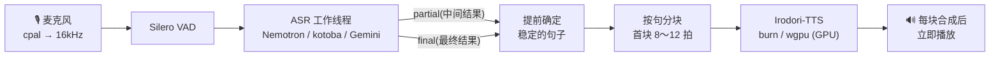

<div align="center">


# sttts-gui

[English](README.md) · [日本語](README.ja.md) · **简体中文**

**说出的话,换一个声音传达。**

一款 Windows 语音对话应用:实时转写麦克风中的语音,并用 [Irodori-TTS](https://github.com/Aratako/Irodori-TTS)
以你选择的声音朗读出来。<br>
从界面到麦克风、VAD、ASR、TTS,全部**只在一个 Rust 进程中**运行。不需要 Python,也不需要 PyTorch。


[](LICENSE)

</div>

---

> [!NOTE]
> 语音识别和语音合成面向**日语**。Irodori-TTS 是日语 TTS 模型,本地 ASR 也是日语模型。界面语言设置只改变界面显示。

## 特点

- 🎙️ **话还没说完就开始朗读** — 按确定的句子依次合成、播放。即使你还在继续说,朗读也会从每句结束处跟上
- 🦀 **纯 Rust 推理** — 用 [burn](https://burn.dev) 重新实现了 Irodori-TTS 和 kotoba-whisper,并确认与 PyTorch 数值一致。在 Intel Arc B570 上 RTF ≈ 0.3
- 🎭 **声音库** — 拖放约 10 秒的参考音频,就会用那个声音说话。原始说话方式中的语速、停顿等表现也会传给 Irodori
- 🔀 **可选 ASR** — Nemotron 3.5(带标点、本地)/ kotoba-whisper(本地 GPU)/ Gemini Live(云端)
- 🎚️ **支持 ASIO** — 在 ⚙ 详细设置中选择驱动(WASAPI / 各 ASIO 驱动),WASAPI 选择设备,ASIO 选择使用的声道(输入为单声道或 2 声道组合,输出为 2 声道组合或单声道)
- 📦 **自动获取模型** — 首次启动时只从 HuggingFace 下载需要的模型。无需手动准备
- 🌐 **英语 / 日语 / 简体中文界面** — 按 Windows 显示语言启动,可随时在 ⚙ 详细设置中切换
- ⏱️ **始终显示延迟** — 每次都会在标题栏显示从说完话到发出第一个声音的时间(说话结束 → 首音)

## 快速开始

**需要**:Windows 11 / 支持 Vulkan 的 GPU(Intel Arc、NVIDIA、AMD;已在 Intel Arc B570 上验证)/ Rust 1.95 及以上 + MSVC 构建工具 + [LLVM](https://github.com/llvm/llvm-project/releases)(用于生成 ASIO 绑定的 libclang;ASIO SDK 会在构建时自动获取)

```powershell
git clone https://github.com/kjranyone/sttts-gui.git
cd sttts-gui
.\dev.ps1            # 构建并启动(首次会自动下载模型)
```

| 命令 | 用途 |
|---|---|
| `.\dev.ps1 -Mode real` | 使用真实引擎启动(无交互) |
| `.\dev.ps1 -Mode mock` | 不使用模型,只检查界面和连接 |
| `.\dev.ps1 -DebugBuild` | 以 debug 配置启动 |
| `cargo run --release -p sttts-gui -- --real` | 不用脚本直接启动 |

模型大小为 Irodori-TTS ≈3GB + 编解码器 ≈0.4GB + 所选 ASR。与 HuggingFace 缓存(`~/.cache/huggingface/hub`)共用。

### 分发 exe

用 `cargo build --release` 生成的 `target/release/sttts-gui.exe` 可以单独运行(内置图标、VAD 模型和 onnxruntime)。设置和声音库(`data/`)、生成的 WAV(`output/`)保存在以下位置:

1. 设置了环境变量 `STTTS_ROOT` 时,保存在那里
2. exe 所在文件夹可写时,保存在 exe 的文件夹(放在 U 盘等处的便携用法)
3. 不可写时(Program Files 等),保存在 `%LOCALAPPDATA%\sttts-gui`

分发目标需要 [Visual C++ 可再发行组件](https://learn.microsoft.com/cpp/windows/latest-supported-vc-redist)(x64),以及支持 DirectX 12 / Vulkan 的 GPU 驱动。

> [!IMPORTANT]
> **请使用耳机。** 播放期间麦克风保持打开(未实现回声消除)。如果用扬声器,麦克风会收录合成语音,将其转写后再次自动发话,形成循环。

## 工作原理



Irodori-TTS 以句子为单位合成,不支持流式。因此采用伪流式:**把句子切成块 → 逐块合成 → 合成好就播放**。首音时间与首块长度成正比,所以只把首块切短。

整个程序在一个进程中运行。GUI([GPUI](https://github.com/zed-industries/zed/tree/main/crates/gpui) / gpui-kit)与引擎通过通道连接,VAD、ASR、TTS 各自在专用线程上运行。即使在繁重的解码期间,电平表也不会停。详情请参阅[高级设置与调优](docs/configuration.md)(日语)。

## 使用方法

界面把「说了什么 / 怎样表达 / 用哪个声音传达」分开显示。

| 位置 | 功能 |
|---|---|
| **流**(中央) | 一张卡片 = 说的内容(上)和传达它的声音(下)。传达后可以 ▶ 重新播放 / ↻ 用当前声音重新发话 / 修改 |
| **输入框**(下方) | 输入文字后按 **发话**(Ctrl+Enter)。**停止** 会丢弃正在播放和尚未播放的音频 |
| **直播** | 开始/停止麦克风,以及输入电平 |
| **音频队列** | 「自动播放」开启时,识别出的句子会直接朗读。关闭时会停在卡片上,可选择发话、修改或不发话。「还原语速与停顿」会反映原始语音的速度 |
| **声音** | 选择声音库中的声音,以及说话方式提示(Irodori 的 caption) |
| **识别** | 切换云端(Gemini)和本地,输入 Gemini 的 API 密钥 |
| **⚙ 详细设置** | 每台电脑设定一次即可的项目:显示语言、输入输出设备、语音合成模型 |

表演调色板和用表情符号指示表现的方法见 [给 Irodori 的表现指示](docs/irodori-annotations.md),还原说话方式的机制见 [重建发话表现的设计](docs/acting-reconstruction-design.md)(均为日语)。

### 声音库

将参考音频(wav / flac,约 10 秒)拖放到窗口,或在「声音」中点「＋」选择。导入的音频放在 `data/voices/`,并会立即被选中。拖放图片(png / jpg / webp)会将其设为当前所选声音的图标。

> [!CAUTION]
> 参考音频请只使用已获得本人同意的声音。Irodori-TTS 的各模型卡禁止用于冒充真实人物或制作深度伪造。

## 模型

| 角色 | 模型 | 运行环境 | 备注 |
|---|---|---|---|
| TTS | [Irodori-TTS v4.1 Small MeanFlow](https://huggingface.co/Aratako/Irodori-TTS-v4.1-Small-MF) | GPU(burn / wgpu) | RTF ≈ 0.3(Arc B570)。不进行 CPU 推理 |
| ASR | Nemotron 3.5 ASR streaming 0.6B | CPU(onnxruntime) | **输出标点**,精度接近 whisper large-v3。中间结果从上次的计算继续,开销小。不擅长只有元音的连续(如「あいうえお」) |
| ASR | [kotoba-whisper-v2.0](https://huggingface.co/kotoba-tech/kotoba-whisper-v2.0) | GPU(burn / wgpu) | 默认。不输出标点。10 秒的发话约需 4 秒 |
| ASR | Gemini 3.5 Transcribe Live | 云端 | 最快。需要 API 密钥(在 GUI 中输入,用 DPAPI 加密保存) |
| VAD | [Silero VAD](https://github.com/snakers4/silero-vad) | CPU(ONNX) | 嵌入在二进制文件中 |

## 项目结构

```
crates/
├── gui/        GPUI 客户端。在进程内启动引擎
├── engine/     后端主体:设置、分块、TTS 工作线程、直播会话
├── protocol/   GUI ⇄ 引擎的消息类型
├── i18n/       显示语言(en / ja / zh)与文案的内联翻译
├── irodori/    Irodori-TTS 的纯 Rust 推理(设计与精度 → docs/irodori-rs.md)
├── whisper/    kotoba-whisper 的纯 Rust 推理
├── nemotron/   Nemotron 3.5 ASR(ONNX)
├── gemini/     Gemini Live API 客户端
├── audio/      麦克风、重采样、Silero VAD
└── hub/        HuggingFace Hub 缓存查找与自动下载
```

## 开发

```powershell
cargo test -p sttts-engine          # 无需真实模型和设备即可验证整个管线
cargo test --workspace --release    # 所有 crate(没有参考数据的一致性测试会跳过)
```

引擎通过 `Platform` trait 注入外部世界(设备、模型)。测试中插入假的麦克风、VAD、ASR、TTS,验证 mic-first、停止→重新开始的冷却、取消以及逐句朗读。与 PyTorch 数值一致性测试所用的参考数据,可以用 `tools/reference/` 中的脚本生成(运行应用不需要)。

界面文案在调用处并列写出三种语言(`tr!("English", "日本語", "中文")`),漏译会导致编译错误。

参与贡献前请阅读 [AGENTS.md](AGENTS.md)(日语),其中包括硬件验证策略和设计前提。

## 故障排除

| 症状 | 处理 |
|---|---|
| 无法初始化 GPU | 确认 GPU 和驱动支持 Vulkan(Intel Arc 请更新到最新驱动)。不会自动回退到 CPU |
| 「语音合成设备已停止」 | GPU 设备丢失。请重新启动应用 |
| 句中短暂停顿就被切断 | 将 `asr.vad_min_silence_ms` 提高到 350〜400 |
| 收录合成语音导致循环 | 使用耳机 |
| 第一次发话前等待很久 | 首次运行需要下载模型并准备 GPU 内核。从第二次起,启动后会立即在后台开始加载 |
| 无法打开麦克风 | 解除其他应用的独占。可以在 ⚙ 详细设置中选择输入设备 |
| 无法打开 ASIO 设备 | 同一时间只能使用一个 ASIO 驱动,输入和输出不能选择不同的 ASIO 驱动(请使用同一个驱动,或其中一方使用 WASAPI)。另请确认 DAW 等其他应用没有占用。采样率和缓冲区遵循驱动控制面板中的设置 |
| 构建时找不到 `asiodrivers.h` | `%TEMP%\asio_sdk` 以内容丢失的状态残留。删除该文件夹后重新构建,会重新获取 SDK |
| 识别很慢 | 选择 Gemini,或在本地使用 `asr.engine: "nemotron"` |

日志显示在 GUI 下方的面板和 `data/gui.log`(每次启动时重建)中。设置键的列表见 [docs/configuration.md](docs/configuration.md)(日语)。

## 致谢

- [Irodori-TTS](https://github.com/Aratako/Irodori-TTS)(MIT)以及 [v4.1-Small-MF](https://huggingface.co/Aratako/Irodori-TTS-v4.1-Small-MF)、[Semantic-DACVAE-Japanese-32dim](https://huggingface.co/Aratako/Semantic-DACVAE-Japanese-32dim)(MIT),水印使用 [SilentCipher](https://huggingface.co/sony/silentcipher)。各模型卡在许可证之外还有道德使用限制
- [kotoba-whisper-v2.0](https://huggingface.co/kotoba-tech/kotoba-whisper-v2.0)(Apache-2.0)
- Nemotron 3.5 ASR streaming(代码 Apache-2.0 / 权重 OpenMDW-1.1)
- [silero-vad](https://github.com/snakers4/silero-vad)(MIT,`crates/audio/assets/LICENSE`)
- [burn](https://burn.dev)(Apache-2.0 / MIT)、onnxruntime(MIT)、gpui-kit / Zed GPUI(Apache-2.0)

## 许可证

[MIT](LICENSE)。但 `crates/nemotron/` 源自参考实现,因此为 Apache-2.0(`crates/nemotron/LICENSE`)。

模型权重不包含在本仓库中,遵循各自的许可证和使用限制(见上方致谢)。
